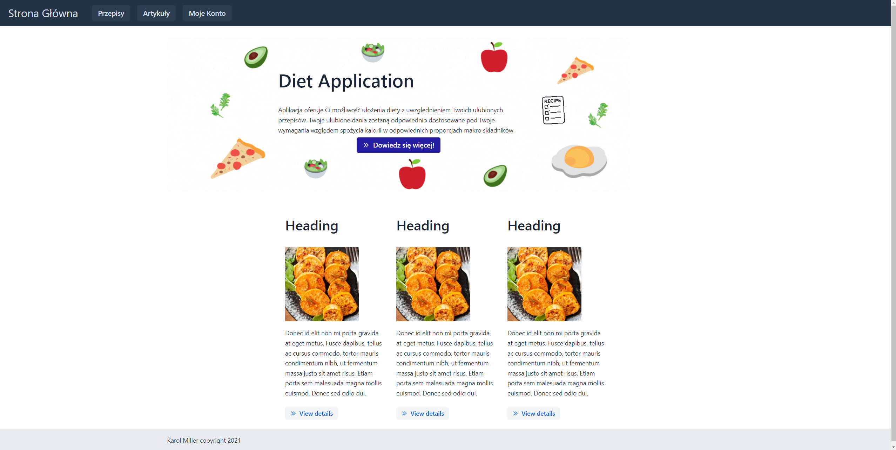
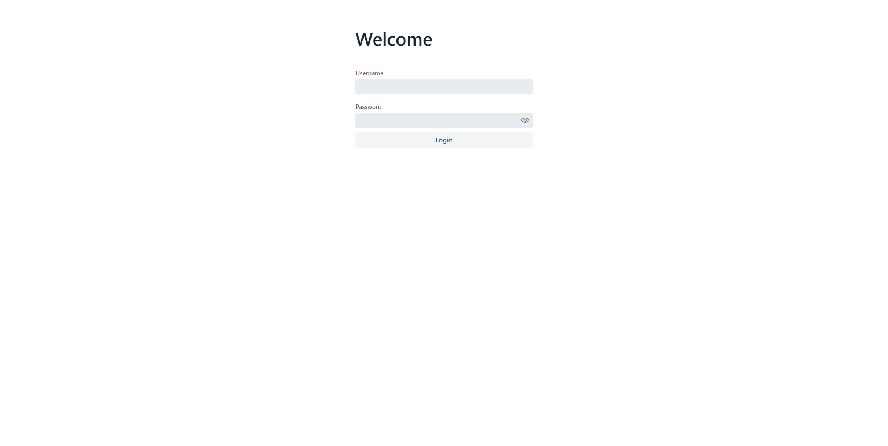
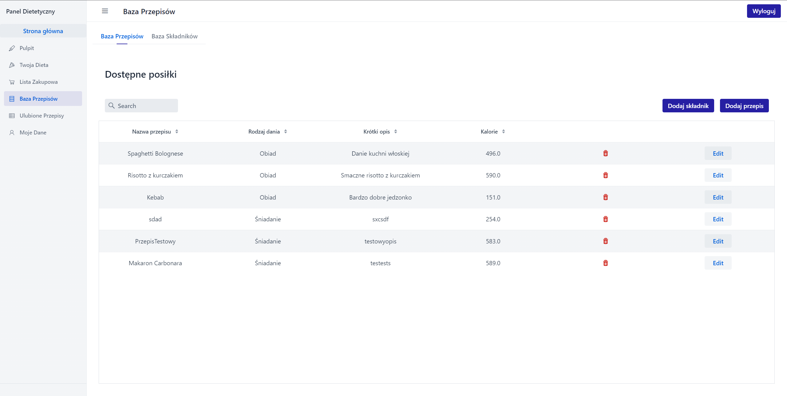
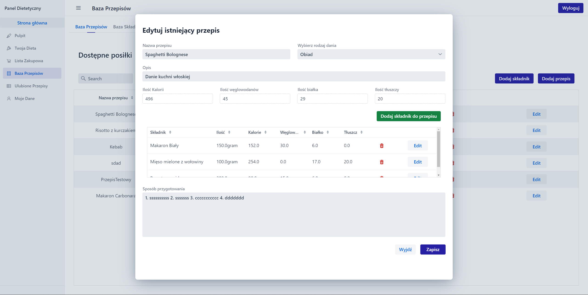
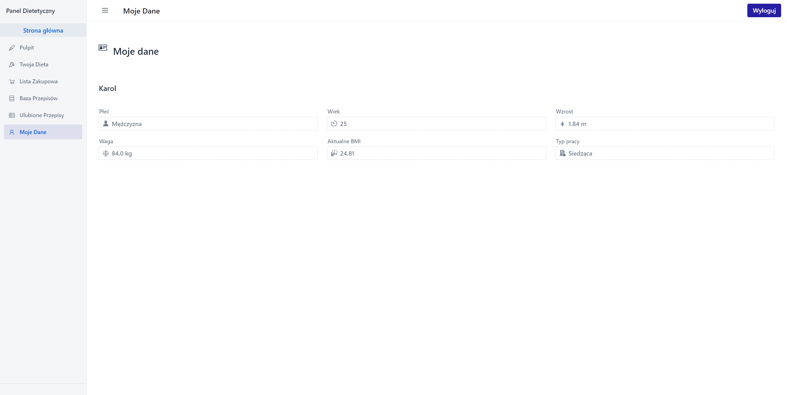

# Diettetican App

Application for managing meals in the diet.
## Table of Contents
- [Screenshots](#screenshots)
- [Technologies](#technologies)
- [Project description](#project-description)
- [How to Install and Run the Project](#how-to-install-and-run-the-project)
- [Scope of funcionalities](#scope-of-funcionalities)
- [Example of use](#example-of-use)
- [Status](#status)
## Technologies
Project is created with:
- Java 16,
- Vaadin 22 - frontend framework for web using Java language,
- Maven, 
- Spring Boot,
- Spring Data JDBC
- PostgreSQL 14,

## Screenshots






## Project description

The application is used to manage the menu, you can schedule for a specific time. The system has a database of meals that the user can use. If you have your favorite dishes, you can add them to the database. When preparing a diet, you do not worry about how many calories are in a given dish, the system will calculate the proportion of weight for your caloric needs. The system also has the option to generate a shopping list to PDF and the ability to preview your favorite dishes. The application also has a functionality for dietitians, which is used to arrange diets for its patients who are registered in the system


## How to Install and Run the Project

**1. Project**

You need to clone this repository. Everything what you need to run project is including in maven dependency and project package. Project you can start by running **DietAppApplication.java** in src.main.java.pl.dietapp. Project wll be launched on **localhost:8082**, but you need to configure the database before starting it (information in next step).


If you have error during building the frontend try remove files below
- node_modules,
- package.json,
- package-loc.json
- webpack.config.js

And run this in terminal.

```bash
npm install
```

**2. Database**

You need a database to use the system. I included the database in one SQL files **createDB.sql** in **appDB** directory. Create a database using the **createDB.sql**. The safest and working option is to use PostgreSQL 14 for this. First create a database on your system and name it as you like (for example **dietdb**). Next step you must import **createDB.sql**, dont do this by pgAdmin. The only way that works is import using **psql**. Use the command below for import

```bash
psql -f "D:\PATH TO - > createDB.sql" -U username(probably postgres) -d database_name
```

You will also need information about database properties, which I present below, you can also modify them for yourself in **resources / appliciation.properties**:
```bash
spring.datasource.url=jdbc:postgresql://localhost:5432/dietapp-db
spring.datasource.username=postgres
spring.datasource.password=admin
server.port=8082
```

Login and password for testers users below:

Admin:

- login: KarolAdmin
- password: admin

User:

- login: KarolUser
- password: user

Dietician:

- login: KarolDietician
- password: diet

## Scope of funcionalities

The main functionalities of the project are:
- :black_square_button: Creating your dietary profile, containing information about your weight, caloric needs and BMI,
- :black_square_button: Composing a diet based on existing recipes,  or composing a diet for the user by a dietitian. The grammage of the recipes is calculated for each user depending on the caloric needs of their own profile,
- :white_check_mark: Adding and editing new recipes and ingredients by the admin,
- :black_square_button: Adding new ingredients and recipes by the user, visible only to themselves, with the possibility of making available to the administrator for approval and visibility of the recipe for all,
- :black_square_button: Functionality of composing recipes for customers by a dietitian.
- :black_square_button: Functionality of creating a shopping list for a given period in PDF, and adding recipes to the favorites list,
- :white_check_mark: Logging and authentication system.

Small supporting functionalities:
- :white_check_mark: Dynamic search engine in the recipes and ingredient grid,
- :white_check_mark: Dynamic preview of calories and macro ingredients while creating a recipe,
- :white_check_mark: Adding new ingredients to the base during adding new recipe,
- :black_square_button: Replacing the ingredient with another of the same category during composing diet.

## Example of use

Will continue this section during development

## Status

The current version only has extensive database management functionality


